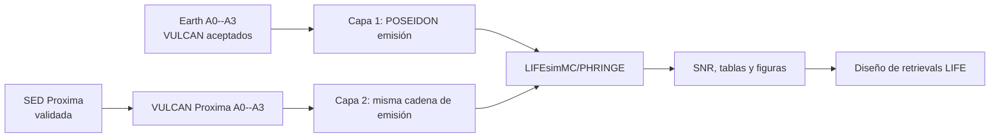

# Etapa III: emisión térmica con LIFE

**Estado: planificada; no ejecutada.** Esta carpeta fija el contrato de la
futura rama de observación directa de ExoFarm. No contiene una instalación de
LIFEsim, espectros de emisión, simulaciones de ruido ni retrievals. Antes de
crear un producto, recuperar el estado desde
[`../docs/project_resume.md`](../docs/project_resume.md) y confirmar el
backlog en [`../docs/project_status_tracker.md`](../docs/project_status_tracker.md).
La próxima implementación se ordena en dos capas: el benchmark Tierra--Sol a
10 pc y, tras nueva fotoquímica, el análogo terrestre bajo el entorno de
Proxima b. Las puertas de activación están aquí, en
[`../docs/life_lifesim_stage_iii_plan.md`](../docs/life_lifesim_stage_iii_plan.md)
y en el [plan operativo de dos capas](../docs/life_stage_iii_two_layer_workplan_2026-07-20.md).

## Papel científico

La Etapa III pregunta cómo se verían las atmósferas fotoquímicas de ExoFarm en
**emisión térmica planetaria** para una observación directa de LIFE. Es una rama
paralela, no una extensión de `Transmission_Spectroscopy/`:



La etapa reutilizará los perfiles PT y de abundancia canónicos exportados en
`../Transmission_Spectroscopy/profiles/`, pero **no** reutilizará espectros de
transmisión, archivos de ruido de PandExo, conteos de tránsitos ni productos de
retrieval JWST como si fueran observaciones LIFE.

Para ruido instrumental, el componente previsto es **LIFEsimMC con PHRINGE**,
no LIFEsim clásico: la documentación del proyecto lo recomienda para espectros
ruidosos de observaciones LIFE de una época y para ruido de inestabilidad
instrumental. LIFEsim clásico puede conservarse como sensibilidad de ruido
astrofísico o yield, pero no sustituye el caso instrumental.

## Alcance de objetivo fijado

La **Capa 1**, `life_earth_sun_10pc`, reutiliza los perfiles Tierra--Sol A0--A3
aceptados y congelados en 2026-06-15 para un análogo G2V a 10 pc. Es un
benchmark sintético de **interfaz** de observación directa: los 10 pc
pertenecen a LIFE, no cambian VULCAN ni describen la Tierra real como objetivo.
A2/A3 anteceden la corrección N2O activa, así que el manifiesto debe usar
`earth_20260615_pre_n2o_correction` y no presentar el resultado como la matriz
vigente sin una decisión/re-run. Véase la
[nota de procedencia](../docs/earth_sun_n2o_matrix_provenance_2026-07-20.md).

La **Capa 2**, `life_proxima_b_earthlike`, es la extensión M prioritaria. No
consumirá los perfiles TRAPPIST-1e: primero construirá SED → flujo superficial
VULCAN → VULCAN Proxima A0--A3, usando inicialmente el PT/Kzz terrestre
controlado. Solo tras aceptar esos perfiles repetirá emisión, LIFE, SNR y diseño
de retrievals. Se trata de un análogo terrestre en el ambiente de Proxima b,
no de una atmósfera medida de Proxima b.

El análogo TRAPPIST-1-like a 5 pc, Teegarden's Star b y TRAPPIST-1e real quedan
como controles/alternativas diferidos. La justificación, los límites y las
referencias están en
[`../docs/life_target_selection_2026-07-20.md`](../docs/life_target_selection_2026-07-20.md)
y el [plan operativo de dos capas](../docs/life_stage_iii_two_layer_workplan_2026-07-20.md).

## Estructura acordada

La estructura mínima ya existe como documentación de carpetas, pero no contiene
configuraciones ejecutables ni resultados. Los productos solo aparecerán cuando
se active una campaña con un manifiesto completo.

```text
Thermal_Emission_Spectroscopy/
├── README.md                         # este contrato de etapa
├── configs/
│   ├── life_earth_sun_10pc/          # manifiestos de la Capa 1
│   └── life_proxima_b_earthlike/     # manifiestos LIFE posteriores a VULCAN
├── scripts/                          # adaptadores y validadores futuros
├── notebooks/                        # análisis reproducible futuro
├── outputs/<campaign-id>/
│   ├── manifest.yaml                 # procedencia, versiones y parámetros
│   ├── forward_emission/             # espectros fuente de POSEIDON
│   ├── molecular_diagnostics/        # contrafactuales y bandas
│   ├── lifesim/                      # datos, SED extraído y covarianza
│   ├── tables/                       # tablas de SNR auditables
│   ├── plots/                        # figuras de diagnóstico/presentación
│   └── retrievals/                   # resultados y logs aprobados
└── final_products/                   # solo figuras promovidas explícitamente
```

Los ficheros de configuración, manifiestos y scripts pequeños deben estar
versionados. Los productos voluminosos se guardarán bajo `outputs/` o fuera de
Git según su tamaño, siempre con un manifiesto de procedencia.

## Contrato de entrada y salida

### Entradas que deberán congelarse

- **Capa 1:** los pares PT y mezcla Tierra--Sol A0--A3 en
  `../Transmission_Spectroscopy/profiles/`, enlazados a sus `.vul` canónicos
  mediante escenario y hash/ruta. El manifiesto debe registrar el rótulo
  `earth_20260615_pre_n2o_correction` y los BC históricos/activos pertinentes.
  Los perfiles TRAPPIST-1e no se consumen.
- **Capa 2:** solo después de aceptar VULCAN, los pares PT/química Proxima y un
  manifiesto que enlace SED MUSCLES, conversor a flujo superficial, parámetros
  estelares/orbitales, PT/Kzz terrestre controlado y supuestos planetarios.
- Parámetros planetarios, estelares, distancia, geometría orbital y escena
  astrofísica, consistentes entre POSEIDON y LIFEsimMC.
- Configuración exacta del forward de emisión de POSEIDON: malla espectral,
  opacidades, superficie si aplica y cantidad física exportada.
- Versión/commit de LIFEsimMC, PHRINGE y POSEIDON; diseño LIFE, resolución,
  fondos, zodi/exozodi, tiempo de integración, semilla y modelo de ruido.

### Productos esperados cuando se active

1. Espectro térmico de referencia sin ruido generado por POSEIDON.
2. Señales moleculares de `N2O` y `NH3`, acompañadas por moléculas de control
   que expliquen degeneraciones o solapamientos espectrales.
3. Observación simulada por LIFEsimMC/PHRINGE, SED extraído, incertidumbres y
   covarianza espectral.
4. Tabla de SNR por escenario, molécula, banda, tiempo de integración y
   realización de ruido; figuras que muestren señal e incertidumbre.
5. Una campaña de retrievals diseñada a partir de esos diagnósticos, no antes.

## Puertas de activación

No ejecutar una campaña por el mero hecho de crear esta estructura. La secuencia
obligatoria será:

### Capa 1 — benchmark

1. Registrar versiones, licencia y entorno de LIFEsimMC/PHRINGE y POSEIDON,
   más el rótulo/checksums de procedencia del conjunto Tierra--Sol.
2. Validar sin ruido el forward de emisión, la superficie/emisividad y la
   conversión entre contraste, flujo y radiancia custom de LIFEsimMC.
3. Ejecutar un único piloto de ruido para `life_earth_sun_10pc` con semilla,
   manifiesto y covarianza preservados; después diagnosticar A0--A3.
4. Validar SNR, controles moleculares y covarianza antes de diseñar retrievals.

### Capa 2 — Proxima

1. Congelar SED MUSCLES fuente, metadatos/checksum y una extensión MIR
   documentada; convertirla a flujo superficial VULCAN sin doble escalado.
2. Crear, ejecutar y aceptar los cuatro perfiles Proxima A0--A3 con el PT/Kzz
   terrestre controlado antes de crear cualquier producto LIFE.
3. Repetir las puertas de la Capa 1 con sus propios manifiestos, productos y
   decisiones de retrieval.

## Límites actuales

- La Etapa 0 (LPJmL) está suspendida. La Etapa III no debe presentar la matriz
  A0--A3 como un forzamiento derivado de LPJmL hasta reactivar y completar ese
  puente. Además, el perfil-set Tierra--Sol de Capa 1 no equivale aún a los BC
  N2O actuales; esa decisión se conserva en la nota de procedencia.
- Los perfiles TRAPPIST-1e conservan la salvedad de convergencia parcial de
  VULCAN junto a cualquier producto de control futuro que los utilice; no
  condicionan la Capa 1 ni se heredan como excepción para Proxima.
- `life_proxima_b_earthlike` es una rama controlada de entorno estelar. Sin un
  PT/Kzz climático independiente no autoriza afirmaciones sobre el clima o la
  atmósfera real de Proxima b.
- No asumir que un SNR alto equivale a una detección: la campaña futura deberá
  contrastar modelos, degeneraciones y desajuste de perfiles verticales.
- La interfaz estándar de datos de POSEIDON admite `Fp/Fs` o `Fp` con errores
  por bin; LIFEsimMC puede producir covarianza completa. La estrategia de
  whitening o likelihood correlacionado es una puerta de activación, no una
  simplificación silenciosa.

## Referencias de activación

- [LIFEsimMC: cuándo usarlo](https://lifesimmc.readthedocs.io/en/latest/when_to_use.html)
- [LIFEsimMC: espectro custom](https://lifesimmc.readthedocs.io/en/latest/tutorials/custom_spectrum.html)
- [LIFEsimMC: instrumento perturbado](https://lifesimmc.readthedocs.io/en/latest/tutorials/perturbed_instrument_example.html)
- [POSEIDON: forward de emisión](https://poseidon-retrievals.readthedocs.io/en/latest/content/notebooks/emission_basic.html)
- [Plan operativo de dos capas](../docs/life_stage_iii_two_layer_workplan_2026-07-20.md)
- [Procedencia N2O del benchmark Tierra--Sol](../docs/earth_sun_n2o_matrix_provenance_2026-07-20.md)
- [Selección de objetivo y referencias científicas](../docs/life_target_selection_2026-07-20.md)
