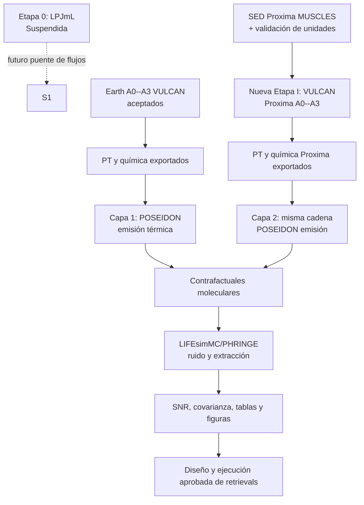

# Plan de la Etapa III: emisión térmica, LIFE y LIFEsimMC

**Fecha de registro:** 2026-07-20
**Estado:** diseño registrado; sin instalación, configuración ejecutable,
espectros, ruido ni retrievals de LIFE.
**Dependencias aguas arriba:** perfiles fotoquímicos VULCAN aceptados y sus
exportaciones PT/química. La Etapa 0 (LPJmL) está suspendida por decisión del
proyecto.

**Reanudación:** leer primero [`project_resume.md`](project_resume.md) y
[`project_status_tracker.md`](project_status_tracker.md).

**Actualización operativa (2026-07-20):** la implementación se organiza en dos
capas: `life_earth_sun_10pc` usa el conjunto Tierra--Sol aceptado y congelado
el 2026-06-15 como benchmark de interfaz pre-corrección de N2O, y
`life_proxima_b_earthlike` comienza aguas arriba con una nueva rama VULCAN
basada en la SED de Proxima. El plan secuencial, los contratos de entrada y las
puertas entre capas están en
[`life_stage_iii_two_layer_workplan_2026-07-20.md`](life_stage_iii_two_layer_workplan_2026-07-20.md). La separación entre este
benchmark y la matriz actual está en
[`earth_sun_n2o_matrix_provenance_2026-07-20.md`](earth_sun_n2o_matrix_provenance_2026-07-20.md).

## Pregunta y alcance

La Etapa III extenderá la interpretación observacional de ExoFarm hacia una
observación directa de emisión térmica con LIFE. La pregunta primaria es si las
perturbaciones de `N2O` y `NH3` del conjunto Tierra--Sol A0--A3 congelado dejan diferencias recuperables en un análogo Tierra--Sol (G2V) situado a 10 pc
después de aplicar un modelo de observación LIFE con LIFEsimMC y PHRINGE. La
atribución a la matriz N2O vigente queda condicionada a la decisión de
procedencia/rerun indicada arriba.

Esto es distinto de la Etapa II. Allí POSEIDON produce espectros de transmisión
para JWST y PandExo simula ruido de tránsito. En esta etapa POSEIDON deberá
producir un espectro térmico fuente, y LIFEsimMC deberá convertirlo en una
observación LIFE con ruido astrofísico e instrumental. Ni el observable, ni las
unidades, ni el presupuesto de observación pueden heredarse implícitamente de
la campaña JWST.

LIFEsim clásico se conserva como referencia de simulación astrofísica/yield,
pero la propia documentación de LIFEsimMC recomienda este último para espectros
de una época y estudios de ruido instrumental. Por esa razón, esta etapa usa el
nombre abreviado LIFE/LIFEsim pero su ruta técnica prevista es LIFEsimMC/PHRINGE.

## Jerarquía de objetivos

La jerarquía de objetivos y la evidencia de literatura se registran en
[`life_target_selection_2026-07-20.md`](life_target_selection_2026-07-20.md).
No debe sustituirse por una búsqueda informal de un planeta conocido.

- **Capa 1 / primario: `life_earth_sun_10pc`.** Es el primer caso LIFE que se
  puede preparar: un análogo Tierra--Sol a 10 pc que consume los perfiles
  Tierra--Sol A0--A3 congelados como benchmark de interfaz
  `earth_20260615_pre_n2o_correction`. La distancia pertenece a la escena LIFE,
  no modifica VULCAN ni convierte a la Tierra real en un objetivo observado.
  Un resultado científico de la matriz vigente exige antes una decisión/rerun.
- **Capa 2 / extensión aprobada: `life_proxima_b_earthlike`.** Es un análogo
  terrestre sintético en el ambiente radiativo y la geometría documentada de
  Proxima b. Antes de cualquier emisión/LIFE requiere SED MUSCLES validada,
  conversión a flujo superficial VULCAN y cuatro nuevos perfiles A0--A3.
  No es una predicción de la atmósfera real de Proxima b.
- **Controles diferidos:** el análogo TRAPPIST-1-like a 5 pc, Teegarden's Star
  b y TRAPPIST-1e real conservan interés científico, pero no sustituyen estas
  dos capas ni generan productos por analogía.

## Flujo acordado

La flecha desde LPJmL está deliberadamente punteada: A0--A3 siguen siendo los
forzamientos controlados actuales, no resultados agrícolas nuevos.

## Hechos técnicos que restringen el diseño

- POSEIDON puede calcular un espectro de emisión al usar
  `spectrum_type='emission'`; su tutorial representa el producto como
  \(F_p/F_*\). [Documentación de emisión de POSEIDON](https://poseidon-retrievals.readthedocs.io/en/latest/content/notebooks/emission_basic.html)
- La entrada custom de LIFEsimMC es un texto de dos columnas: longitud de onda
  en \(\mu\mathrm{m}\) y radiancia en
  \(\mathrm{W\,sr^{-1}\,m^{-2}\,\mu m^{-1}}\). No es automáticamente el
  contraste \(F_p/F_*\) de POSEIDON. [Contrato de espectro custom](https://lifesimmc.readthedocs.io/en/latest/tutorials/custom_spectrum.html)
- LIFEsimMC fue diseñado para espectros LIFE de una época con ruido instrumental
  y puede entregar estimaciones de covarianza espectral; LIFEsim clásico modela
  ruido astrofísico, no la evolución temporal de inestabilidades. [Cuándo usar
  LIFEsimMC](https://lifesimmc.readthedocs.io/en/latest/when_to_use.html)
- En el caso de instrumento perturbado, LIFEsimMC documenta whitening ZCA con
  estrella de calibración para tratar correlaciones temporales/espectrales.
  [Tutorial de instrumento perturbado](https://lifesimmc.readthedocs.io/en/latest/tutorials/perturbed_instrument_example.html)
- El lector estándar de datos de POSEIDON recibe centro de bin, semi-ancho,
  espectro y error, con `Fp/Fs` o `Fp` como unidades soportadas. Por tanto, un
  retrieval que use productos LIFEsimMC necesita una decisión explícita sobre
  covarianza/whitening, no una conversión implícita a errores diagonales.
  [Formato de datos de POSEIDON](https://poseidon-retrievals.readthedocs.io/en/latest/autoapi/POSEIDON/utility/index.html)

## Contratos científicos y técnicos

| Paso | Entrada congelada | Producto futuro | Validación necesaria antes de continuar |
| --- | --- | --- | --- |
| I-Proxima SED y fotoquímica | SED MUSCLES fuente, conversor a superficie, parámetros/órbita y PT/Kzz terrestre controlado | `.vul` Proxima A0--A3 y pares PT/química exportados | Preservar fuente/checksum, verificar unidades y una sola escala `(R_star/a)^2`, aceptar VULCAN antes de Stage III |
| IIIa Forward térmico | `life_earth_sun_10pc`: perfiles Tierra--Sol A0--A3 etiquetados `earth_20260615_pre_n2o_correction`, estrella, planeta, distancia y configuración POSEIDON; o perfiles Proxima ya aceptados | Espectro de emisión sin ruido con unidades y malla declaradas | Verificar unidades, eje, radios, definición de flujo/contraste/radiancia y procedencia de BC |
| IIIb Señal molecular | Forward completo y contrafactuales de una molécula | Diferencias espectrales, bandas candidatas y tabla de picos | Confirmar que el contrafactual no modifica parámetros ajenos y declarar solapamientos |
| IIIc LIFE | Espectro fuente convertido y manifiesto instrumental | Datos sintéticos, SED extraído, errores, covarianza y metadatos | Prueba de interfaz y un caso reproducible con versión/semilla registradas |
| IIId SNR | Señal definida y ruido/covarianza exportados | CSV/Markdown de SNR y figuras | Separar SNR por bin, por banda y combinado; declarar tratamiento de covarianza |
| IIIe Retrievals | Datos ruidosos validados y matriz aprobada | Posteriores, evidencias, espectros recuperados y logs | Recuperar una verdad conocida y comparar modelos con/sin moléculas objetivo |

### Interfaz POSEIDON → LIFEsimMC

Antes de automatizarla se debe registrar un adaptador pequeño y probado que
fije, como mínimo:

- conversión entre \(F_p/F_*\), flujo observado y radiancia de entrada;
- radio planetario, radio/temperatura estelar, distancia y geometría usada;
- unidades, rango, orden del eje, resolución y binning;
- tratamiento de regiones fuera de cobertura;
- versión de ambos paquetes, opacidades y archivos de entrada;
- prueba de conservación de forma y normalización en un caso sin ruido.

Un gráfico visualmente razonable no sustituye esta validación de interfaz.

## Diagnóstico molecular y SNR

Las moléculas objetivo iniciales son `N2O` y `NH3`. `H2O`, `CO2`, `O3` y `CH4`
deben conservarse como controles cuando compartan bandas o expliquen
degeneraciones; la selección final se registrará con la primera configuración de
emisión.

Para cada escenario se guardarán el forward completo y un diagnóstico
contrafactual definido de manera explícita. Una opción a validar es reemplazar
solo el perfil de la molécula objetivo por el perfil de referencia A0, manteniendo
los demás parámetros fijos. La señal debe definirse en el manifiesto, por
ejemplo \(\Delta y_i(\lambda)=y_{\mathrm{full}}(\lambda)-y_{i,\mathrm{ref}}(\lambda)\).

Si el piloto es ideal y usa incertidumbres independientes por bin, se podrá
reportar, como diagnóstico y no como prueba de detección,

\[
\mathrm{SNR}_{i,\mathrm{band}} =
\left[\sum_{k\in\mathrm{band}}
\left(\frac{\Delta y_i(\lambda_k)}{\sigma_k}\right)^2\right]^{1/2}.
\]

Con ruido instrumental perturbado, datos y modelos deben pasar por whitening
coherente o un likelihood que use la matriz de covarianza \(\mathbf C\). Una
tabla de \(\sigma_i\) sola no basta. Las tablas incluirán escenario, molécula,
banda, tiempo de integración, configuración LIFE, semilla/realización,
definición de señal, método de covarianza y ruta al espectro de origen.

Las figuras mínimas serán: (1) forward completo y contrafactuales, (2) señal
molecular frente a incertidumbre, (3) SNR por banda/tiempo/escenario y (4) una
figura de control que muestre solapamientos y/o covarianza. Ninguna se
etiquetará como detección formal sin retrieval y evidencia correspondiente.

## Diseño futuro de la campaña de retrievals

La campaña no se define aún con tiempos o números de realizaciones inventados.
Para `life_earth_sun_10pc`, los forwards y la tabla de SNR cubrirán A0--A3;
cuando los pasos IIIa--IIId y la decisión de procedencia estén validados, se
empezará por una matriz de retrieval piloto A0/A3 y se decidirá su ampliación a
A1/A2 con evidencia de SNR. La rama `life_proxima_b_earthlike` requiere una
decisión de retrieval independiente después de validar sus perfiles y SNR. Cada
fila deberá
fijar:

- escenario, estrella/objetivo, configuración LIFE y tiempo de integración;
- realización de ruido/semilla y versión de LIFEsimMC/PHRINGE;
- modelo directo y parámetros libres de POSEIDON;
- priors, superficie, perfil PT y tratamiento de abundancias verticales;
- modelos comparados: al menos referencia y variantes con/sin `N2O` o `NH3`;
- producto esperado, criterio de terminación y costo computacional;
- pruebas de recuperación de una verdad conocida y análisis de sesgo por
  desajuste de perfil.

El criterio para lanzar retrievals es doble: la interfaz y el SNR deben estar
validados, y la matriz debe tener una entrada en `experiments/README.md` con
aprobación explícita. La evidencia bayesiana y los falsos positivos/negativos
requieren varias realizaciones de ruido; no se inferirán de un único espectro.

## Backlog de activación

### Capa 1 — `life_earth_sun_10pc`

1. `[x]` Registrar la capa de benchmark y sus cuatro pares de perfiles
   Tierra--Sol A0--A3 como insumo congelado de interfaz
   `earth_20260615_pre_n2o_correction`.
2. Decidir y registrar rerun con los BC N2O actuales o uso histórico explícito
   antes de interpretar SNR/retrievals LIFE como la matriz vigente.
3. Confirmar versión, licencia, entorno y documentación primaria de LIFEsimMC,
   PHRINGE y LIFEsim clásico, sin asumir que el entorno `POSEIDON` sirve.
4. Congelar escena, superficie/emisividad, parámetros físicos, malla, fondos y
   configuración LIFE sin usar tránsitos como proxy de tiempo de integración.
5. Implementar y probar el wrapper de emisión POSEIDON y el adaptador de
   radiancia para LIFEsimMC, con una prueba sin ruido.
6. Ejecutar un piloto de ruido, preservar SED extraído/covarianza y producir
   diagnósticos moleculares, tabla SNR y figuras.
7. Diseñar, revisar y aprobar retrievals A0/A3 solo después de esa evidencia.

### Capa 2 — `life_proxima_b_earthlike`

1. `[x]` Definir Proxima como extensión M prioritaria y fijar el PT/Kzz terrestre
   controlado como baseline, no como clima observado de Proxima b.
2. Obtener, archivar y describir la SED MUSCLES fuente; congelar versión,
   cobertura, estado de actividad, checksum y extensión MIR requerida por LIFE.
3. Implementar/validar la conversión a flujo superficial VULCAN y congelar
   radio estelar, órbita, supuestos planetarios y geometría de iluminación.
4. Crear y aceptar VULCAN A0--A3 Proxima antes de exportar perfiles.
5. Repetir la cadena de emisión, LIFE, SNR y propuesta de retrievals sin mezclar
   productos con la Capa 1.

## Límites y trazabilidad

- No duplicar los `.vul` crudos: los productos canónicos permanecen en
  `Photochemical_Modeling/Results/Outputs/`; los perfiles de trabajo son los
  exportados en `Transmission_Spectroscopy/profiles/`.
- No mezclar archivos de PandExo/JWST con `outputs/<campaign-id>/lifesim/`.
- Cada campaña enlazará commit, configuración, rutas de insumos, entorno y
  productos. Los datos grandes fuera de Git deben tener manifiesto con tamaño y
  checksum cuando sea práctico.
- La salvedad de convergencia parcial de VULCAN para TRAPPIST-1e acompaña solo
  un eventual control futuro; no es una limitación de los perfiles Tierra--Sol
  que alimentan la campaña primaria ni una excepción que pueda heredarse a
  `life_proxima_b_earthlike`.
- La salvedad de procedencia N2O del Earth--Sun de junio sí acompaña todos los
  productos de Capa 1 hasta la decisión/rerun documentada; no se transfiere a
  los perfiles TRAPPIST regenerados en `fb9812d` ni a la futura rama Proxima.
- La fuente MUSCLES de Proxima y su extensión MIR deben conservar procedencia y
  checksum; no se reutiliza el factor de escala de TRAPPIST-1 ni se aplica dos
  veces la geometría estrella--planeta.
