# Plan operativo de dos capas para la Etapa III LIFE

**Fecha de decisión:** 2026-07-20
**Estado:** estructura y secuencia aprobadas; no se han generado espectros de
emisión, observaciones LIFE, simulaciones de ruido ni retrievals nuevos.
**Reanudación:** leer [`project_resume.md`](project_resume.md), el
[`project_status_tracker.md`](project_status_tracker.md) y, para Capa 1, la
[nota de procedencia N2O](earth_sun_n2o_matrix_provenance_2026-07-20.md).

## Decisión y pregunta científica

La Etapa III se ejecutará como dos capas consecutivas y explícitamente
distintas.

1. **Capa 1 — `life_earth_sun_10pc`:** demostrar y validar toda la cadena de
   emisión térmica y observación LIFE usando los perfiles Tierra--Sol A0--A3
   que ya convergieron en VULCAN. Es el benchmark instrumental/químico
   `earth_20260615_pre_n2o_correction`, no todavía la matriz N2O vigente.
2. **Capa 2 — `life_proxima_b_earthlike`:** construir una nueva rama
   fotoquímica bajo la SED observada de Proxima Centauri y, solo después de
   aceptarla, repetir la misma cadena de emisión y LIFE. Es un experimento de
   entorno estelar M activo, no una predicción de la atmósfera desconocida de
   Proxima b.

La primera capa responde primero: *¿la interfaz de emisión y observación LIFE
preserva de forma trazable las diferencias del conjunto A0--A3 congelado al
colocar el sistema a 10 pc?* La interpretación de esas diferencias como matriz
ExoFarm vigente exige resolver la procedencia de N2O indicada más abajo. La
segunda responde: *¿cómo cambia ese experimento controlado cuando se sustituye
el entorno radiativo solar por el de una M5.5 activa y cercana?*

La distancia de 10 pc pertenece solo a la escena observacional de la Capa 1.
No se altera la fotoquímica Tierra--Sol existente. La Capa 2 usará la geometría
del sistema Proxima b que se congele en su manifiesto, no una distancia
hipotética elegida para imitar TRAPPIST-1.

```mermaid
flowchart LR
    subgraph L1["Capa 1: benchmark Tierra-Sol a 10 pc"]
      E1["Earth_A0-A3.vul\naceptados"] --> X1["PT y química canónicos"]
      X1 --> P1["POSEIDON\nemisión térmica"]
      P1 --> M1["contrafactuales\nN2O/NH3"]
      M1 --> L1N["LIFEsimMC/PHRINGE\nruido y extracción"]
      L1N --> S1["SNR, tablas y figuras"]
    end
    S1 --> G{"puerta de\nvalidación"}
    subgraph L2["Capa 2: entorno Proxima b"]
      R["SED MUSCLES\n+ extensión MIR validada"] --> C["conversión a flujo\nsuperficial VULCAN"]
      C --> V["VULCAN A0-A3\nPT/Kzz terrestre controlado"]
      V --> X2["PT y química Proxima"]
      X2 --> P2["misma cadena\nPOSEIDON → LIFE"]
    end
    G --> R
```



## Capa 1 — `life_earth_sun_10pc`

### Insumos ya existentes

Esta capa debe cargar los perfiles fotoquímicos existentes, no reconstruirlos
ni sustituirlos por una atmósfera genérica de POSEIDON:

| Escenario | VULCAN canónico | Hand-off PT/química canónico |
| --- | --- | --- |
| A0 | `Photochemical_Modeling/Results/Outputs/Earth_A0_PreAgri.vul` | `Transmission_Spectroscopy/profiles/Earth_A0_PreAgri_{PT,chem}.txt` |
| A1 | `Photochemical_Modeling/Results/Outputs/Earth_A1_Current.vul` | `Transmission_Spectroscopy/profiles/Earth_A1_Current_{PT,chem}.txt` |
| A2 | `Photochemical_Modeling/Results/Outputs/Earth_A2_Moderate.vul` | `Transmission_Spectroscopy/profiles/Earth_A2_Moderate_{PT,chem}.txt` |
| A3 | `Photochemical_Modeling/Results/Outputs/Earth_A3_Extreme.vul` | `Transmission_Spectroscopy/profiles/Earth_A3_Extreme_{PT,chem}.txt` |

Los cuatro productos alcanzaron `end_case = 1`. El exportador
[`export_vulcan_profiles.py`](../Transmission_Spectroscopy/scripts/export_vulcan_profiles.py)
define el contrato actual: PT contiene altitud (km), presión (bar) y
temperatura (K); química contiene presión (bar) y los mixing ratios por
especie. Antes del primer forward se comprobará que los archivos siguen en
sincronía con los `.vul` de origen, pero no se duplicarán los `.vul` bajo la
rama de emisión.

> **Salvedad de matriz:** los perfiles A2/A3 se guardaron el 2026-06-15 con
> `N2O = 3.35e9` y `1.20e10`, previos a los BC activos corregidos (`3.416e9` y
> `1.238e10`). Por ello, la primera tarea usa el conjunto como benchmark de
> interfaz y lo etiqueta `earth_20260615_pre_n2o_correction`; no declara SNR o
> retrievals como resultado de la matriz vigente sin una decisión/re-run.
> Evidencia y regla: [nota de procedencia](earth_sun_n2o_matrix_provenance_2026-07-20.md).

### Secuencia autorizada

1. Congelar un manifiesto de `life_earth_sun_10pc`: parámetros Tierra--Sol,
   10 pc, arquitectura LIFE, banda, resolución, fondos, zodi/exozodi, tiempo
   de integración y versiones de POSEIDON, LIFEsimMC y PHRINGE. El manifiesto
   debe declarar el rótulo de procedencia pre-corrección y checksums/rutas de
   PT, química y BC; esta es la primera acción autorizada.
2. Construir un wrapper de **emisión** de POSEIDON que lea el par PT/química
   de cada escenario. La estrella PHOENIX usada por los scripts actuales de
   transmisión no cuenta como interfaz LIFE validada.
3. Producir primero un forward A0 sin ruido y comprobar malla, cantidad física,
   radios, distancia y normalización. Después generar A0--A3.
4. Construir contrafactuales de `N2O` y `NH3`, con `H2O`, `CO2`, `O3` y `CH4`
   como controles de solapamiento.
5. Convertir el producto de emisión a la radiancia requerida por LIFEsimMC,
   validando explícitamente la cadena entre contraste, flujo observado y
   radiancia. Un gráfico razonable no basta como prueba de unidades.
6. Ejecutar un piloto LIFEsimMC/PHRINGE reproducible y guardar observación,
   SED extraído, incertidumbres, covarianza, semilla y configuración.
7. Generar tablas y figuras de señal/SNR de interfaz. Antes de interpretarlas
   como la matriz actual, decidir y registrar el rerun o rótulo histórico de
   Tierra--Sol. Solo cuando se conozcan la señal y el tratamiento de covarianza
   se diseñará una matriz de retrievals; no se lanzan retrievals en esta capa
   de planificación.

## Capa 2 — `life_proxima_b_earthlike`

### Alcance y elección de PT

La Capa 2 es una nueva rama de **Etapa I** antes de ser una extensión LIFE. Su
salida será un conjunto nuevo de perfiles VULCAN que Stage III consumirá con el
mismo contrato de la Capa 1.

El perfil inicial elegido es el perfil terrestre controlado
`VULCAN/atm/atm_Earth_Jan_Kzz.txt`, con la misma física de mezcla vertical que
el caso Tierra--Sol. Esta elección aísla el cambio que se quiere medir primero:
la SED de una M activa. No se usará silenciosamente el PT lineal/`100x CO2` de
TRAPPIST-1e, porque codifica una hipótesis climática distinta. Tampoco se
presentará este PT terrestre como una estimación de la atmósfera real de
Proxima b.

Una sensibilidad climática posterior requerirá un PT/Kzz de origen externo,
una justificación de composición superficial/volátiles y una nueva decisión de
campaña. No es requisito para iniciar el experimento controlado, pero sí para
hacer afirmaciones sobre el planeta real.

### Precondiciones de la nueva fotoquímica

1. **Conservar y citar la SED fuente.** Usar el producto pancromático
   MUSCLES v22 de Proxima Centauri de MAST, junto con sus notas de reducción y
   la versión/fecha de descarga. Es comparable en procedencia a
   Mega-MUSCLES, pero no debe confundirse con la SED de TRAPPIST-1.
2. **Construir un conversor reproducible.** Guardar la SED original bajo
   `Photochemical_Modeling/Config/Stellar_Spectra/` o como insumo externo con
   checksum; generar un archivo de dos columnas para
   `VULCAN/atm/stellar_flux/` en nm y
   `erg cm^-2 s^-1 nm^-1` en la superficie estelar. Documentar cada conversión
   de longitud de onda, flujo, distancia y radio.
3. **Validar irradiancia y cobertura.** Comparar la integral bolométrica y las
   bandas UV relevantes tras escalar con los parámetros estelares/orbitales
   congelados. Para la escena térmica LIFE se debe documentar además una
   extensión fotosférica validada sobre la cobertura MIR de la SED MUSCLES;
   no se extrapola un continuo sin procedencia.
4. **Crear una configuración VULCAN separada.** La futura carpeta
   `Photochemical_Modeling/Config/planets/earth_proxima_b/` tendrá cuatro YAML
   A0--A3, parámetros de estrella/órbita, el SED Proxima superficial y nombres
   de salida inequívocos. El runner se parametrizará o clonará sin modificar
   los casos Tierra--Sol o TRAPPIST-1e.
5. **Aceptar la química antes de Stage III.** Cada producto debe registrar la
   terminación de VULCAN, validaciones de especies/flujo y el carácter de
   experimento controlado. La salvedad de convergencia de TRAPPIST-1e no se
   hereda automáticamente a esta rama.
6. **Exportar y repetir la cadena.** Una vez aceptados, los perfiles
   `Proxima_b_A0--A3` se exportarán con el mismo formato PT/química y se
   procesarán mediante POSEIDON, LIFEsimMC/PHRINGE, diagnósticos de SNR y una
   futura decisión de retrievals.

### Qué queda fuera de alcance

- No se infiere que Proxima b tenga una atmósfera terrestre, superficie sólida
  observable, radio terrestre o inventario A0--A3.
- No se combinan flares como una perturbación silenciosa dentro de la SED
  quiescente. Una sensibilidad flare/XUV será una variante de configuración
  separada tras establecer el baseline quiescente.
- No se reutilizan las configuraciones, espectros o tiempos de tránsito JWST.

## Estructura de trabajo

```text
Thermal_Emission_Spectroscopy/
├── configs/
│   ├── life_earth_sun_10pc/          # manifiestos de la Capa 1
│   └── life_proxima_b_earthlike/     # manifiestos LIFE posteriores a VULCAN
├── scripts/                          # validadores y adaptadores futuros
├── notebooks/                        # análisis reproducible futuro
├── outputs/<campaign-id>/
│   ├── manifest.yaml
│   ├── forward_emission/
│   ├── molecular_diagnostics/
│   ├── lifesim/
│   ├── tables/
│   ├── plots/
│   └── retrievals/
└── final_products/

Photochemical_Modeling/
├── Config/Stellar_Spectra/           # SED Proxima fuente + conversión auditada
├── Config/planets/earth_proxima_b/   # futura rama VULCAN A0--A3
└── Results/Outputs/                  # futuros Proxima_b_A*.vul canónicos
```

Las carpetas de Capa 2 bajo `Thermal_Emission_Spectroscopy/` no implican que
existan todavía perfiles Proxima. La dependencia siempre es:
SED validada → VULCAN aceptado → perfil exportado → emisión → LIFE.

## Puertas entre capas y criterios de terminación

| Puerta | Evidencia mínima | Autoriza |
| --- | --- | --- |
| Capa 1, interfaz | Forward A0 y conversión de radiancia sin ruido verificados | Forward A0--A3 y contrafactuales |
| Capa 1, observación | Piloto LIFE con configuración/semilla/covarianza preservadas | Tabla SNR y figuras |
| Capa 1, procedencia | Decisión documentada: rerun con BC N2O actuales o uso histórico explícito del conjunto 2026-06-15 | Interpretación científica A0--A3 y propuesta de retrievals |
| Capa 1, interpretación | Señales, solapamientos y covarianza evaluados | Diseño de retrievals piloto A0/A3 |
| Proxima, SED | Fuente, conversor, unidades, superficie e irradiancia auditados | Crear YAML y lanzar VULCAN |
| Proxima, química | A0--A3 con terminación y perfiles validados | Exportar a la Capa 2 LIFE |
| Proxima, observación | Misma interfaz POSEIDON--LIFEsimMC validada para sus perfiles | Diagnóstico/SNR y propuesta de retrievals |

## Fuentes y documentos vinculados

- [MAST MUSCLES: SED y productos de Proxima Centauri](https://archive.stsci.edu/hlsp/muscles)
- [Notas de reducción del producto Proxima MUSCLES v22](https://archive.stsci.edu/missions/hlsp/muscles/gj551/hlsp_muscles_multi_multi_gj551_broadband_v22_reduction-notes.pdf)
- [LIFE X: Proxima b entre los objetivos conocidos evaluados](https://doi.org/10.1051/0004-6361/202347027)
- [Plan general LIFE/LIFEsimMC](life_lifesim_stage_iii_plan.md)
- [Selección de objetivos y límites de interpretación](life_target_selection_2026-07-20.md)
- [Contrato de perfiles fotoquímicos](photochemical_profiles_methodology.md)
- [Procedencia N2O del benchmark Tierra--Sol](earth_sun_n2o_matrix_provenance_2026-07-20.md)

