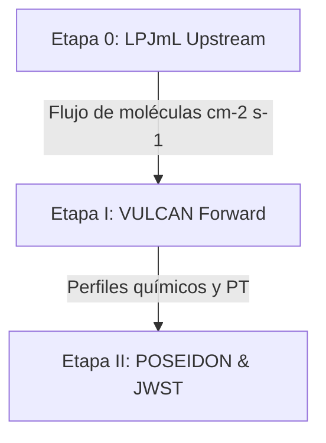

# ExoFarm Project Status and Management Tracker

**Fecha de actualización:** 2026-06-29  
**Proósito:** Centralizar el estado operativo, dependencias de software, decisiones de diseño y tareas técnicas pendientes (backlog) del pipeline ExoFarm.

---

## 1. Estado Operativo de las Etapas

### Etapa 0: Flujos Agrícolas Upstream ([Agricultural_Fluxes_LPJmL](file:///c:/Proyetos/Repos/ExoFarm_MDwarfs/Agricultural_Fluxes_LPJmL/README.md))
*   **Estado:** En desarrollo metodológico.
*   **Implementación:** Scripts de conversión de unidades de masa de N a flujo molecular completados ([convert_lpjml_n_flux.py](file:///c:/Proyetos/Repos/ExoFarm_MDwarfs/Agricultural_Fluxes_LPJmL/scripts/convert_lpjml_n_flux.py)).
*   **Pendiente:** Instalación local de LPJmL en Ubuntu/WSL y acoplamiento directo de salidas reales.

### Etapa I: Modelado Fotoquímico ([Photochemical_Modeling](file:///c:/Proyetos/Repos/ExoFarm_MDwarfs/Photochemical_Modeling/README.md))
*   **Tierra-Sol:** Completado. Los 4 escenarios ($\text{A0}$ a $\text{A3}$) alcanzaron estado estacionario (`end_case = 1`).
*   **TRAPPIST-1e:** Completado y aceptado con salvedad de convergencia parcial (`end_case = 3`). La discrepancia se atribuye a especies traza de baja abundancia ($\text{C_2H_5}$ a $\sim 0.019\,\text{bar}$).
*   **Parámetros Físicos:** Corregidos y auditados el 2026-06-15 (radio planetario, gravedad, espectro solar y remoción del duplicado de $\text{H_2SO4}$).

### Etapa II: Espectroscopia de Transmisión y Retrieval ([Transmission_Spectroscopy](file:///c:/Proyetos/Repos/ExoFarm_MDwarfs/Transmission_Spectroscopy/README.md))
*   **Espectros Forward y Ruido:** Completado para la grilla de 1 tránsito y tránsitos acumulados.
*   **Campaña de Inversión (Advertencia Importante):** Las 42 corridas de MultiNest guardadas en el repositorio son **obsoletas / científicamente inválidas** debido a que se ejecutaron antes de corregir los perfiles fotoquímicos (promovidos el 2026-06-15). Queda pendiente re-definir la campaña de retrievals; se planea reducir el número total de combinaciones (no serán tantas corridas) y volver a ejecutar estas simulaciones utilizando los perfiles corregidos.
*   **Capa Curada:** Figuras finales de publicación generadas en [final_products/figures/](file:///c:/Proyetos/Repos/ExoFarm_MDwarfs/Transmission_Spectroscopy/final_products/figures/) (deben actualizarse tras re-ejecutar la campaña).

---

## 2. Dependencias de Software y Entorno

*   **VULCAN:** Solver fotoquímico local ubicado en el directorio `/VULCAN`.
*   **POSEIDON:** Código de retrieval bayesiano (v1.4) ejecutado en Ubuntu/WSL dentro del entorno Anaconda `POSEIDON`. **(Instalado y configurado con éxito junto a 72 GB de input data en `/home/wsldasan/POSEIDON/inputs`).**
*   **Espectro Solar Gueymard:** Confirmado del año **2018** (Gueymard 2018).
*   **Espectro TRAPPIST-1:** Proveniente de la grid Mega-MUSCLES, escalado a flujo superficial.

---

## 3. Decisiones de Diseño Clave

| Fecha | Decisión | Razón / Justificación | Estado |
| :--- | :--- | :--- | :--- |
| 2026-06-15 | **Aceptar TRAPPIST-1e en `end_case = 3`** | La no-convergencia está dominada por química traza irrelevante para espectros ($\text{C_2H_5}$). | **Cerrado** (Aceptado con salvedad) |
| 2026-06-30 | **Promover Modelo TRAPPIST-1e Lin PT + 100x CO2** | Se adopta el perfil térmico P-T de Lin et al. (2023) y una abundancia de $CO_2$ de $3.6\%$ ($100\text{x}$) como el nuevo baseline oficial. Los antiguos modelos isoquímicos (Earth PT, 400ppm) pasan a ser legacy. | **Cerrado** |
| 2026-06-29 | **Estructura Térmica de TRAPPIST-1e Abierta** | Superado por la decisión del 2026-06-30 de adoptar Lin et al. | **Cerrado / Actualizado** |
| 2026-06-29 | **Preservar Modelo Isoquímico** | El retrieval asume mezcla química constante con la altura (isoquímico) e isotérmico para mantener la uniformidad de la campaña de 42 corridas. | **Cerrado** |
| 2026-06-29 | **Re-definir y Re-ejecutar Campaña de Retrievals** | Los retrievals existentes se consideran obsoletos por usar perfiles antiguos (y ahora el nuevo PT de Lin). Se re-definió la matriz de combinaciones a 18 corridas clave. Pendiente ejecución. | **Abierto / Planificado** |
| 2026-06-29 | **Mantener `sl_angle = 48 deg`** | Se decidió ignorar el frente abierto sobre el ángulo cenital y mantener la configuración actual (heredada). | **Cerrado / Descartado** |
| 2026-07-01 | **Corregir Alpha N2O y Noise Floor** | Se alinearon los flujos de N2O con los alpha 2.55 y 15. Se impuso piso de ruido de 10ppm en PandExo. | **Cerrado** |
| 2026-07-01 | **Optimización Matriz de Retrievals** | Se redujo la campaña de 42 a 18 corridas, enfocándose solo en A0 y A3. Para mantener el tiempo de observación constante, "both" usa la mitad de tránsitos (ej: 5+5=10). Los tiempos totales simulados son equivalentes a 10, 100 y 200 tránsitos. | **Planificado** |
| 2026-07-02 | **Migración de Notebook a Script (Plot Posterior)** | Se extrajo el código del notebook `Plot_Profile_Posterior_Comparison_TRAPPIST.ipynb` al script oficial `plot_profile_posterior_comparison.py` para mayor robustez e integración con la nueva matriz de observaciones. | **Cerrado** |
| 2026-07-02 | **Corrección de Priors y Piso de Superficie** | Se activó `surface=True` con un prior entre $10^{-2}$ y $10$ bar. El límite superior de abundancia se abrió a $100\%$ (`LOG_X_UPPER=0.0`) y el inferior se bajó a $10^{-10}$. Excepción: para el $NH_3$ se definió un prior especial de $10^{-12}$ a $10^{-4}$ para acomodar su naturaleza traza. | **Cerrado** |

---

## 4. Tareas Pendientes e Incertidumbres (Backlog Técnico)

### Prioridad Alta (LPJmL y Re-corridas Críticas)
1.  `[x]` Definir la nueva matriz optimizada de combinaciones para la campaña de retrievals (reduciendo el número de ejecuciones respecto a las 42 originales).
2.  `[ ]` Re-ejecutar la campaña optimizada de retrievals con POSEIDON/MultiNest en Ubuntu/WSL utilizando los perfiles fotoquímicos corregidos.
3.  `[ ]` Instalar LPJmL en la ruta [Agricultural_Fluxes_LPJmL/software/LPJmL/](file:///c:/Proyetos/Repos/ExoFarm_MDwarfs/Agricultural_Fluxes_LPJmL/software/LPJmL/) (fuera del control de Git).
4.  `[ ]` Correr simulaciones piloto LPJmL regionales/globales con ciclo de N activo.
5.  `[ ]` Acoplar las salidas de LPJmL generadas como forzamiento real de la Etapa I.

### Prioridad Media (Etapa I y II - Fotoquímica y Espectros)
5.  `[x]` Investigar la inconsistencia matemática en $\alpha_{N_2O}$ (nominal $2.55$/$15$ vs. implícito en VULCAN $2.46$/$14.47$). -> *Corregido en BC txts*.
6.  `[ ]` Generar múltiples realizaciones de ruido sintético de PandExo para medir estadísticamente tasas de falsos positivos y falsos negativos en la distinguibilidad de escenarios.
7.  `[ ]` Ejecutar comparaciones de evidencia bayesiana de MultiNest (corridas con y sin opacidad de $\text{N_2O}$ y $\text{NH_3}$) para derivar significancias de detección formal.
