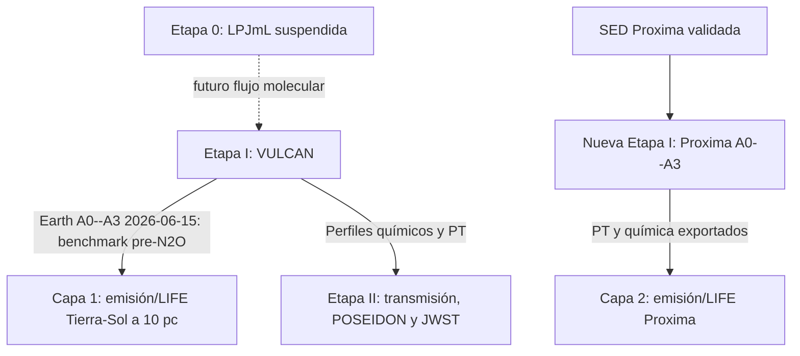

# ExoFarm Project Status and Management Tracker

**Fecha de actualización:** 2026-07-20
**Propósito:** Centralizar el estado operativo, dependencias de software,
decisiones de diseño y tareas técnicas pendientes del pipeline ExoFarm.

**Reanudación:** antes de iniciar trabajo técnico, leer
[`project_resume.md`](project_resume.md). Para la procedencia del benchmark
Tierra--Sol que alimentará LIFE, leer también
[`earth_sun_n2o_matrix_provenance_2026-07-20.md`](earth_sun_n2o_matrix_provenance_2026-07-20.md).

---

## 1. Estado operativo de las etapas

### Etapa 0: flujos agrícolas upstream

- **Estado:** **suspendida por decisión de proyecto el 2026-07-20**. No iniciar
  compilaciones, descargas, pilotos ni acoplamientos hasta reactivación explícita.
- **Activo conservado:** checkout local de LPJmL, workflow
  `modern_vs_no_fertilizer`, notas metodológicas y conversor de masa de N a
  flujo molecular en
  [`convert_lpjml_n_flux.py`](../Agricultural_Fluxes_LPJmL/scripts/convert_lpjml_n_flux.py).
- **Al reactivar:** registrar dataset de entrada, versión/commit, metadatos de
  salida, corridas con ciclo de N y un puente reproducible hacia VULCAN. La
  existencia del checkout no equivale a un forzamiento agrícola validado.

### Etapa I: modelado fotoquímico

- **Tierra-Sol:** completado como conjunto aceptado de 2026-06-15. Los cuatro
  escenarios A0--A3 alcanzaron el estado estacionario guardado (`end_case = 1`).
  A2/A3 anteceden la corrección posterior de N2O: son un benchmark de interfaz
  LIFE, no la realización final de la matriz vigente hasta decidir un rerun o
  su uso explícitamente histórico.
- **TRAPPIST-1e:** completado y aceptado con salvedad de convergencia parcial
  (`end_case = 3`), atribuida a `C2H5` traza alrededor de 0.019 bar.
- **Parámetros físicos:** corregidos y auditados el 2026-06-15 (radio
  planetario, gravedad, espectro solar y eliminación del duplicado de `H2SO4`).
- **Proxima / nueva rama:** planificada, sin SED versionada, YAML, perfiles ni
  corridas todavía. Será una rama VULCAN A0--A3 con PT/Kzz terrestre controlado
  y no una modificación de Earth--Sun ni TRAPPIST-1e.

### Etapa II: espectroscopia de transmisión y retrieval

- **Espectros forward y ruido:** completados para la campaña de transmisión
  TRAPPIST-1e.
- **Campaña de inversión actual:** la matriz optimizada A0/A3 de 18 combinaciones
  terminó en Ubuntu/WSL con los perfiles fotoquímicos corregidos. El commit
  `fb9812d` actualizó los BC N2O y regeneró los `.vul`/exports TRAPPIST usados
  por esta rama; la salvedad Earth--Sun de junio no se transfiere aquí. Las
  últimas cuatro ejecuciones cerraron el 2026-07-12 con código 0. Las 42 corridas
  anteriores se preservan como evidencia legacy, no como base de interpretación
  actual.
- **Capa curada:** las figuras actuales viven en
  [`Transmission_Spectroscopy/final_products/`](../Transmission_Spectroscopy/final_products/)
  y deben mantener la salvedad de convergencia parcial de TRAPPIST-1e.

### Etapa III: emisión térmica, LIFE y LIFEsimMC

- **Estado:** **planificada; no ejecutada.** No hay instalación/configuración
  versionada de LIFEsimMC/PHRINGE, espectros de emisión, observaciones LIFE,
  tablas de SNR ni retrievals de esta etapa.
- **Objetivo:** generar forwards de emisión térmica con POSEIDON desde los
  perfiles fotoquímicos, diagnosticar señales de `N2O`/`NH3`, simular ruido
  astrofísico e instrumental de LIFE, analizar SNR y solo después diseñar una
  campaña de retrievals.
- **Contrato:** es una rama paralela a transmisión/JWST. No reutiliza espectros
  de transmisión, ruido PandExo ni conteos de tránsitos como entradas LIFE.
  La ruta técnica de ruido instrumental prevista es LIFEsimMC/PHRINGE; LIFEsim
  clásico queda para referencia astrofísica/yield.
- **Programa de dos capas:** `life_earth_sun_10pc` usa el conjunto Tierra--Sol
  congelado de 2026-06-15 para la primera validación de interfaz. La
  interpretación científica de la matriz vigente queda bloqueada por la
  salvedad de N2O. `life_proxima_b_earthlike` es la
  segunda capa: primero SED → VULCAN Proxima A0--A3; luego la misma cadena de
  emisión/LIFE. Ninguna tiene productos LIFE autorizados todavía.
- **Plan y puertas de activación:**
  [`docs/life_lifesim_stage_iii_plan.md`](life_lifesim_stage_iii_plan.md),
  [plan operativo de dos capas](life_stage_iii_two_layer_workplan_2026-07-20.md)
  y [`Thermal_Emission_Spectroscopy/README.md`](../Thermal_Emission_Spectroscopy/README.md).
  La selección y sus límites están en
  [`docs/life_target_selection_2026-07-20.md`](life_target_selection_2026-07-20.md).

---

## 2. Dependencias de software y entorno

- **VULCAN:** solver fotoquímico local en `VULCAN/`.
- **POSEIDON:** código de forward/retrieval en el entorno Anaconda `POSEIDON` de
  Ubuntu/WSL. Las rutas activas y requisitos de entrada están documentados en
  `Transmission_Spectroscopy/README.md`.
- **PandExo:** simulación de ruido de JWST exclusiva de la Etapa II.
- **LIFEsimMC + PHRINGE:** dependencias futuras de la Etapa III. Antes de una
  corrida se deben congelar versión/commit, licencia, entorno, diseño LIFE,
  escena astrofísica y la compatibilidad con la exportación de emisión de
  POSEIDON.
- **Espectro solar local Gueymard:** su ruta, archivo y checksum deben
  preservarse junto con la cita metodológica; no sustituirlo por una SED solar
  genérica al construir el benchmark.
- **Espectro TRAPPIST-1:** procedente de Mega-MUSCLES y escalado a flujo
  superficial en la etapa fotoquímica.
- **Espectro Proxima futuro:** MUSCLES/MAST, con metadatos, checksum,
  conversor a flujo superficial VULCAN y extensión MIR explícitamente
  documentados antes de cualquier corrida.

---

## 3. Decisiones de diseño clave

| Fecha | Decisión | Razón / justificación | Estado |
| :--- | :--- | :--- | :--- |
| 2026-06-15 | Aceptar TRAPPIST-1e en `end_case = 3` | La no convergencia está dominada por química traza irrelevante para los objetivos espectrales. | Cerrado con salvedad |
| 2026-06-30 | Promover Lin PT + `100x CO2` para TRAPPIST-1e | Perfil térmico y abundancia de `CO2` adoptados como baseline oficial; los isoquímicos anteriores pasan a legacy. | Cerrado |
| 2026-07-01 | Corregir `alpha_N2O` y piso de ruido | Se alinearon los flujos de `N2O` con los alpha 2.55 y 15, y se impuso el piso de ruido de PandExo. | Cerrado |
| 2026-07-02 | Migrar el plot de posterior de notebook a script | `plot_profile_posterior_comparison.py` se convirtió en la ruta más robusta para la matriz vigente. | Cerrado |
| 2026-07-02 | Corregir priors y piso de superficie | Se activó `surface=True`, con priors revisados para abundancias y presión superficial. | Cerrado |
| 2026-07-12 | Completar campaña optimizada de retrievals | Las 18 corridas A0/A3 finalizaron; advertencias de borde de prior quedan como salvedad, no como fallos. | Cerrado |
| 2026-07-13 | Promover el par conjunto A0/A3 de 100+100 | Presupuesto total de 200 tránsitos para las figuras actuales; 5/50 se conservan como legacy. | Cerrado |
| 2026-07-20 | Suspender la Etapa 0 LPJmL | Mantener código, checkout y documentación, pero no dedicar ejecución ni acoplamiento mientras se prioriza la interpretación observacional. | Activo / suspendido |
| 2026-07-20 | Crear una Etapa III separada para LIFE | Emisión térmica y observación directa requieren un observable, una interfaz instrumental y métricas diferentes de transmisión/JWST. | Planificado |
| 2026-07-20 | Usar LIFEsimMC/PHRINGE para ruido instrumental | LIFEsimMC modela inestabilidades y covarianza; LIFEsim clásico no sustituye este caso. | Planificado |
| 2026-07-20 | Adoptar Tierra--Sol a 10 pc como objetivo LIFE primario | Es un benchmark publicado para retrievals LIFE y para LIFEsimMC con ruido correlacionado; reutiliza el conjunto Tierra--Sol convergido como interfaz pre-corrección y aísla la perturbación A0--A3. | Cerrado para alcance; interpretación pendiente de procedencia |
| 2026-07-20 | Priorizar Proxima como segunda capa M | Proxima b combina una geometría LIFE favorable con una SED MUSCLES pública; la rama se etiqueta como análogo terrestre bajo el entorno Proxima, no como atmósfera observada. | Planificado / bloqueado por fotoquímica |
| 2026-07-20 | Usar PT/Kzz terrestre controlado para el baseline Proxima | Aísla el efecto de sustituir la SED solar por la de Proxima; una sensibilidad climática requiere una campaña y evidencia distintas. | Cerrado para alcance inicial |
| 2026-07-20 | Separar el benchmark Tierra--Sol de junio de la matriz N2O corregida | Los perfiles A2/A3 aceptados usan `3.35e9`/`1.20e10`; los BC activos usan `3.416e9`/`1.238e10`. El benchmark puede validar interfaz LIFE, pero resultados científicos finales requieren rerun o rótulo histórico explícito. | Abierto: decisión antes de interpretación LIFE |
| 2026-07-20 | Diferir M8V a 5 pc, Teegarden y TRAPPIST-1e real | Siguen siendo preguntas alternativas de geometría/fotoquímica, no sustitutos de las dos capas aprobadas. | Activo / diferido |
| 2026-07-20 | Bloquear retrievals LIFE hasta validación | No lanzar retrievals sin interfaz POSEIDON--LIFEsimMC, piloto de ruido y diagnósticos de señal/SNR aprobados. | Planificado |

---

## 4. Tareas pendientes e incertidumbres

### Suspendido: Etapa 0 LPJmL

1. `[~]` Reactivar LPJmL solo con decisión explícita; el checkout existe, pero
   faltan datos de entrada y una corrida auditable.
2. `[ ]` Al reactivar: correr pilotos regionales/globales con ciclo de N activo.
3. `[ ]` Al reactivar: acoplar salidas reales de LPJmL a los lower-boundary
   fluxes de la Etapa I, con unidades/metadatos auditados.

### Prioridad activa: validación de Etapa II

1. `[ ]` Generar múltiples realizaciones de ruido PandExo para medir tasas de
   falsos positivos y negativos en distinguibilidad de escenarios.
2. `[ ]` Ejecutar comparaciones de evidencia bayesiana con y sin opacidad de
   `N2O`/`NH3`; no presentar un posterior como detección sin ese análisis.
3. `[ ]` Mantener separados los productos de la campaña optimizada de 18
   corridas y la evidencia legacy de 42 corridas.

### Prioridad próxima: Etapa III LIFE/LIFEsimMC (sin ejecutar todavía)

#### Capa 1 — `life_earth_sun_10pc`

1. `[x]` Registrar el conjunto Tierra--Sol A0--A3 de 2026-06-15 y sus pares
   PT/química como benchmark congelado de interfaz, etiquetado
   `earth_20260615_pre_n2o_correction`.
2. `[ ]` Decidir y registrar si se rerun/reexporta Tierra--Sol A0--A3 con los
   BC N2O corregidos antes de interpretar SNR/retrievals LIFE como matriz actual;
   si no, conservar el rótulo histórico en todos los productos.
3. `[ ]` Verificar LIFEsimMC, PHRINGE y LIFEsim clásico; fijar versión, licencia
   y entorno.
4. `[ ]` Congelar estrella/planeta, 10 pc, geometría, superficie/emisividad,
   zodi/exozodi, malla, resolución y configuración instrumental. No usar
   tránsitos como proxy.
5. `[ ]` Validar la interfaz POSEIDON → radiancia LIFEsimMC: `Fp/Fs`, flujo,
   radiancia, unidades, malla, normalización y parámetros del sistema.
6. `[ ]` Generar forwards A0--A3 y contrafactuales de `N2O`/`NH3` con moléculas
   de control, primero sin ruido.
7. `[ ]` Ejecutar un piloto LIFEsimMC, preservar SED/covarianza y crear tabla y
   figuras de SNR con semilla/configuración declaradas.
8. `[ ]` Diseñar y aprobar retrievals LIFE solo después de validar covarianza,
   señal y SNR.

#### Capa 2 — `life_proxima_b_earthlike`

1. `[x]` Fijar Proxima como extensión M prioritaria y elegir `atm_Earth_Jan_Kzz.txt`
   como baseline PT/Kzz controlado.
2. `[ ]` Archivar SED MUSCLES fuente con metadatos, cobertura, checksum, estado
   quiescente y extensión MIR requerida.
3. `[ ]` Implementar y validar conversión a flujo superficial VULCAN, con una
   única escala geométrica y parámetros Proxima/órbita documentados.
4. `[ ]` Crear configuración/runner VULCAN A0--A3 separados, ejecutar y aceptar
   perfiles antes de cualquier forward LIFE.
5. `[ ]` Exportar PT/química Proxima y repetir las puertas de emisión, ruido,
   SNR y propuesta de retrievals sin mezclar productos con la Capa 1.
6. `[ ]` Mantener M8V a 5 pc, Teegarden y TRAPPIST-1e real como alternativas
   posteriores sujetas a decisión/insumos separados.
