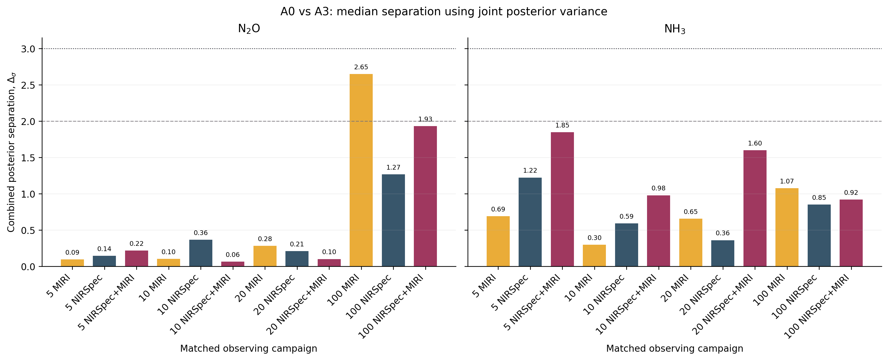
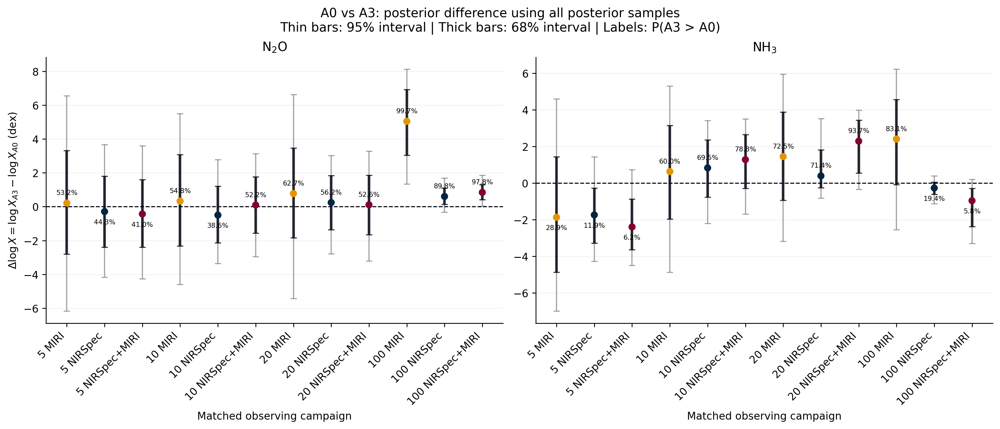
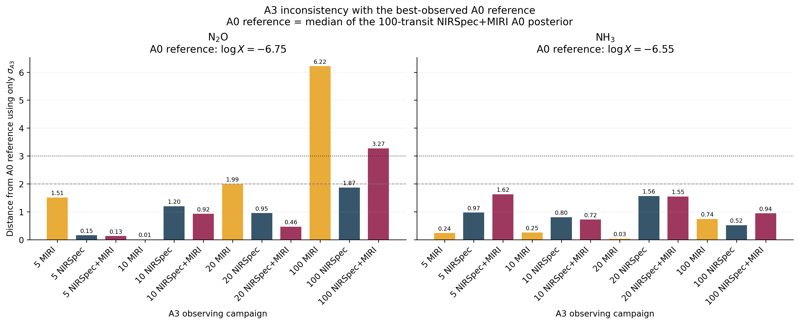

# Distinguibilidad posterior entre A0 y A3 para campañas equivalentes

**Fecha de la bitácora:** 2026-06-10  
**Sistema:** análogo de TRAPPIST-1e  
**Especies recuperadas:** `N2O` y `NH3`  
**Comparación:** línea base preagrícola A0 frente a ExoFarm extremo A3  
**Campañas:** 5, 10, 20 y 100 tránsitos con MIRI, NIRSpec y NIRSpec+MIRI

> [!NOTE]
> **Evidencia fechada, no cola vigente.** Esta comparación conserva resultados
> de la matriz de tránsitos indicada arriba. La campaña actual de 18 retrievals
> A0/A3 y sus configuraciones se definen en el tracker y el README de
> transmisión; no lanzar corridas desde este informe.

> [!WARNING]
> **Estado científico revisado el 2026-06-16:** los perfiles TRAPPIST-1e de
> VULCAN usados aguas arriba terminaron con `end_case = 3`, es decir, excedieron
> el máximo de pasos antes de satisfacer el criterio global de convergencia. La
> auditoría posterior identifica la señal restante como dominada por química
> traza de baja abundancia. Este análisis puede leerse como parte de la campaña
> activa, siempre que se mantenga explícita la caveat de convergencia parcial.

## Pregunta científica

Este análisis no pregunta solamente si una molécula puede detectarse. La
pregunta es más específica:

> Dadas las distribuciones posteriores producidas por el retrieval actual,
> ¿con qué campañas de observación puede distinguirse una atmósfera A3 de una
> atmósfera A0 mediante las abundancias recuperadas de `N2O` o `NH3`?

Detectar una molécula implica demostrar que los datos requieren su opacidad o
abundancia frente a un modelo que no la contiene. Distinguir A3 de A0 implica
demostrar que dos estados atmosféricos producen inferencias suficientemente
diferentes. Los tres gráficos documentados aquí estudian la segunda pregunta
con supuestos progresivamente distintos. Ninguno constituye, por sí solo, una
selección formal entre modelos atmosféricos ni una detección molecular.

La comparación parte de la hipótesis ExoFarm: una agricultura tecnológica a
gran escala podría perturbar el ciclo planetario del nitrógeno y aumentar el
`N2O` y el `NH3` atmosféricos [1]. En el diseño actual del proyecto, A0
representa la línea base natural preagrícola y A3 el extremo superior de
forzamiento agrícola, anclado al marco de tecnosferas S2 [5]. La etapa
espectroscópica pregunta si esos estados continúan siendo
distinguibles después de introducir ruido sintético de JWST y realizar
retrieval atmosférico. La auditoría posterior mostró que los perfiles actuales
no alcanzaron el criterio global estricto de VULCAN, pero fueron aceptados con
una caveat de convergencia parcial dominada por gases traza.

## Por qué se compara únicamente la diagonal

Cada punto compara A0 y A3 usando **el mismo número de tránsitos y la misma
configuración instrumental**. Por ejemplo, A0 con 20 tránsitos NIRSpec+MIRI se
compara únicamente con A3 observado con 20 tránsitos NIRSpec+MIRI.

Esta comparación diagonal responde una pregunta operacional: si el planeta
real fuera A0 o A3, ¿qué tan distintas serían las abundancias inferidas por el
mismo programa de observación? Así se evita confundir una diferencia
atmosférica con una diferencia en los recursos observacionales. Hay doce
comparaciones equivalentes:

```text
4 cantidades de tránsitos x 3 configuraciones instrumentales
= 12 comparaciones
```

Las muestras posteriores provienen de retrievals de POSEIDON muestreados con
MultiNest. El modelo de retrieval es isotérmico e isoquímico: cada molécula se
representa mediante una única razón de mezcla constante con la altura. Esta
aproximación es especialmente importante para `NH3`, cuyo perfil fotoquímico
vertical verdadero puede no representarse adecuadamente mediante una única
abundancia constante.

## Procedencia y reproducibilidad

Las figuras se generan con:

```text
Transmission_Spectroscopy/notebooks/
plot_a0_a3_diagonal_distinguishability.py
```

Las muestras posteriores se cargan desde:

```text
Transmission_Spectroscopy/notebooks/POSEIDON_output/
TRAPPIST-1e/retrievals/samples/
```

Para cada distribución posterior se utiliza como valor central la mediana
\(m\). La anchura de tipo sigma se define como la semiamplitud del intervalo
central del 68%:

\[
\sigma = \frac{q_{84}-q_{16}}{2}.
\]

Esta medida es robusta y permite comparar posteriores que no son perfectamente
gaussianas. Sin embargo, llamarla \(\sigma\) no convierte la distribución en
una gaussiana. Por ello, los cocientes expresados en sigmas deben interpretarse
como diagnósticos compactos de separación; el segundo gráfico, que conserva las
muestras posteriores, retiene más información.

---

## Análisis 1: separación usando la varianza posterior conjunta



### Cálculo

El primer diagnóstico mide la distancia entre las medianas posteriores de A0 y
A3 respecto a la incertidumbre aportada por **ambos** retrievals:

\[
Z_{\mathrm{conj}} =
\frac{\left|m_{A3}-m_{A0}\right|}
{\sqrt{\sigma_{A0}^{2}+\sigma_{A3}^{2}}}.
\]

El denominador corresponde a la propagación usual de varianzas para la
diferencia entre dos cantidades inciertas independientes. Si ambas posteriores
fueran gaussianas e independientes, \(Z_{\mathrm{conj}}\) tendría la
interpretación familiar de una diferencia estandarizada. Aquí se aplica a
medianas y semiamplitudes centrales del 68%; por tanto, debe describirse como
un **diagnóstico de separación posterior**, no como una significancia
frecuentista formal.

La independencia también es una aproximación. Los retrievals A0 y A3 comparten
arquitectura, familias de priors, opacidades y modelo instrumental. Los sesgos
compartidos no aparecen como un término de covarianza en el denominador.

### Qué permite analizar

Este es el diagnóstico más simétrico. Pregunta si las abundancias típicas
recuperadas para A0 y A3 están alejadas en comparación con la imprecisión
combinada de recuperar ambos escenarios. Sirve para ordenar campañas y penaliza
la comparación cuando cualquiera de los dos escenarios queda mal restringido.

### Resultado

Para `N2O`, la mayor separación corresponde a 100 tránsitos MIRI
(\(Z_{\mathrm{conj}}=2.65\)), seguida por 100 NIRSpec+MIRI
(\(Z_{\mathrm{conj}}=1.93\)) y 100 NIRSpec
(\(Z_{\mathrm{conj}}=1.27\)). Todas las campañas con 20 tránsitos o menos
permanecen por debajo de \(0.4\).

Para `NH3`, ninguna campaña alcanza \(2\sigma\). El máximo aparece con
5 tránsitos NIRSpec+MIRI (\(Z_{\mathrm{conj}}=1.85\)), seguido por
20 NIRSpec+MIRI (\(1.60\)). La ausencia de una mejora monótona al aumentar los
tránsitos es una advertencia: el parámetro `NH3` recuperado no se comporta como
un estimador sencillo, limitado únicamente por ruido, de la diferencia entre
A0 y A3.

### Interpretación

**Resultado directo:** los retrievals actuales muestran que las observaciones
MIRI de alta inversión temporal producen la separación A0-A3 más clara en
`N2O`.

**Interpretación del proyecto:** `N2O` es actualmente el discriminante de
abundancia recuperada más creíble de las dos especies agrícolas. `NH3` no
muestra una separación estable entre campañas.

**Lo que no puede afirmarse:** \(Z_{\mathrm{conj}}=2.65\) no constituye una
detección formal de ExoFarm a \(2.65\sigma\), ni demuestra por sí mismo que A3
sea preferible a A0. Resume la distancia entre dos posteriores obtenidas por
separado bajo el modelo actual.

---

## Análisis 2: distribución posterior de la diferencia de abundancias



### Qué significa \(X\)

En este gráfico:

\[
\Delta\log X = \log X_{A3}-\log X_{A0},
\]

donde \(X\) es la razón de mezcla volumétrica recuperada de la molécula
analizada. En el panel izquierdo, \(X=X_{\mathrm{N_2O}}\); en el derecho,
\(X=X_{\mathrm{NH_3}}\). La diferencia se expresa en dex:

- \(\Delta\log X=0\): ambas abundancias recuperadas son iguales;
- \(\Delta\log X=1\): A3 se recupera con diez veces la abundancia de A0;
- \(\Delta\log X=-1\): A3 se recupera con una décima parte de A0.

### Cálculo

Para cada campaña equivalente se extraen independientemente 100 000 valores de
las muestras posteriores de A3 y A0, y se restan:

\[
\Delta\log X^{(k)}
=
\log X_{A3}^{(k)}-\log X_{A0}^{(k)}.
\]

El punto representa la mediana de la distribución resultante. Las barras
gruesas y delgadas contienen el 68% y el 95% central, respectivamente. Cada
porcentaje es:

\[
P(A3>A0)=P(\Delta\log X>0),
\]

estimado como la fracción de diferencias muestreadas mayores que cero.

A diferencia del primer diagnóstico, este cálculo no reduce cada posterior a
una mediana y una anchura antes de compararlas. Conserva asimetrías, colas no
gaussianas y la dirección de la diferencia.

### Qué permite analizar

Es la pregunta bayesiana a nivel de parámetro más directa de los tres
diagnósticos: dadas ambas posteriores y los supuestos actuales, ¿cuál es la
probabilidad posterior de que A3 tenga una abundancia recuperada mayor que A0?
Además, permite evaluar si la diferencia es físicamente grande en dex y no solo
si está bien restringida.

### Resultado

Para `N2O`, únicamente las campañas de 100 tránsitos resultan informativas de
forma consistente:

| Campaña equivalente | Mediana de \(\Delta\log X\) | Intervalo 95% | \(P(A3>A0)\) |
| :--- | ---: | :--- | ---: |
| 100 MIRI | 5.04 dex | [1.33, 8.11] | 99.7% |
| 100 NIRSpec | 0.60 dex | [-0.33, 1.69] | 89.8% |
| 100 NIRSpec+MIRI | 0.84 dex | [0.03, 1.86] | 97.8% |

Las distribuciones de diferencia para 100 MIRI y 100 NIRSpec+MIRI excluyen cero
en su intervalo central del 95%. No obstante, la diferencia mediana
extremadamente grande de 5.04 dex para MIRI, comparada con el resultado más
moderado del modo instrumental conjunto, debe auditarse frente a los priors,
las degeneraciones y posibles sesgos del retrieval antes de interpretarse
físicamente.

Para `NH3`, la dirección de la diferencia cambia entre campañas. Por ejemplo,
20 NIRSpec+MIRI produce \(P(A3>A0)=93.7\%\), mientras que
100 NIRSpec+MIRI produce solamente \(5.8\%\): en este último caso, la
comparación coloca predominantemente A3 **por debajo** de A0. Esto es
incompatible con interpretar la abundancia isoquímica recuperada de `NH3` como
un trazador directo y monótono del forzamiento agrícola A3.

### Interpretación

**Resultado directo:** la distribución completa de diferencias refuerza la
evidencia de que 100 tránsitos pueden separar A3 y A0 en `N2O`, especialmente
para MIRI y para la configuración combinada.

**Interpretación del proyecto:** este es el diagnóstico más defendible de los
tres para describir distinguibilidad a nivel de parámetro, porque usa las
muestras completas y reporta tanto la dirección como la probabilidad de la
diferencia.

**Lo que no puede afirmarse:** \(P(A3>A0)\) no es la probabilidad de que el
planeta sea A3. Está condicionada a dos conjuntos sintéticos, ajustados por
separado, y a los supuestos del retrieval. Para obtener una probabilidad entre
escenarios atmosféricos competidores habría que ajustar el mismo conjunto
observado bajo modelos explícitos A0 y A3 y comparar sus evidencias.

---

## Análisis 3: distancia de A3 respecto a una referencia empírica A0



### Cálculo

El tercer diagnóstico trata el mejor retrieval A0 como referencia y pregunta
qué tan inconsistente es cada posterior A3 con ese valor cuando solo se
contabiliza la incertidumbre de A3:

\[
Z_{A3|\mathrm{A0,ref}} =
\frac{\left|m_{A3}-m_{\mathrm{A0,ref}}\right|}
{\sigma_{A3}}.
\]

La referencia empírica es la mediana de la posterior A0 recuperada con
100 tránsitos NIRSpec+MIRI:

\[
\log X_{\mathrm{A0,ref}}(\mathrm{N_2O})=-6.75,
\qquad
\log X_{\mathrm{A0,ref}}(\mathrm{NH_3})=-6.55.
\]

Para `N2O`, esta elección aproxima el objetivo de utilizar el valor A0
recuperado bajo la campaña con más información. Para `NH3`, es un compromiso
empírico deliberado: el perfil fotoquímico verdadero varía verticalmente,
mientras que el retrieval utiliza una abundancia isoquímica. No existe un único
valor escalar físicamente correcto de `NH3` contra el cual comparar todos los
retrievals.

### Qué permite analizar

Este diagnóstico pregunta cuántas anchuras posteriores de A3 separan la
abundancia recuperada del valor A0 de referencia, suponiendo que dicho valor se
conoce sin incertidumbre. Se parece a un problema de clasificación con una
línea base previamente caracterizada y muestra el poder discriminante potencial
de una observación A3 bajo ese supuesto optimista.

### Resultado

Para `N2O`, la posterior A3 queda a \(6.22\sigma_{A3}\) de la referencia A0 con
100 tránsitos MIRI y a \(3.27\sigma_{A3}\) con 100 NIRSpec+MIRI. Los casos
20 MIRI y 100 NIRSpec se encuentran cerca de \(2\sigma_{A3}\).

Para `NH3`, ninguna campaña supera \(1.63\sigma_{A3}\). Incluso tratando la
referencia A0 como exacta, las posteriores A3 actuales no producen una
separación fuerte y estable.

### Interpretación

**Resultado directo:** una línea base A0 de `N2O` conocida con gran precisión
haría que el retrieval A3 de 100 tránsitos resultara claramente inconsistente
con esa línea base.

**Interpretación del proyecto:** este gráfico ofrece una visión superior y
optimista del desempeño de clasificación. Puede ser útil para discutir cómo
una línea base externa o poblacional fortalecería la interpretación de un
objetivo.

**Lo que no puede afirmarse:** no es una significancia independiente justa para
el experimento actual, porque ignora la incertidumbre de A0. Por construcción,
puede producir valores mayores que el diagnóstico de varianza conjunta. La
referencia también proviene de un retrieval y no de una verdad física conocida
directamente.

---

## Lectura conjunta de los tres gráficos

Los diagnósticos forman una jerarquía útil:

1. **Separación con varianza conjunta:** comparación simétrica y conservadora
   respecto a la imprecisión de ambos escenarios.
2. **Posterior completa de la diferencia:** conserva forma, dirección y
   \(P(A3>A0)\); es la comparación actual más informativa a nivel de parámetro.
3. **A3 frente a referencia A0 fija:** comparación deliberadamente optimista
   que pregunta qué podría lograrse si la línea base ya fuera conocida.

La coincidencia de los tres para `N2O` con muchos tránsitos es científicamente
relevante. Tanto la separación conjunta como la posterior de diferencia
identifican 100 MIRI y 100 NIRSpec+MIRI como las campañas más prometedoras. La
inconsistencia y no monotonía observadas para `NH3` también contienen
información: indican que la abundancia constante recuperada actualmente no es
un discriminante confiable del forzamiento agrícola.

Esto no demuestra que `NH3` carezca de información espectral. Demuestra que esa
información no se recupera robustamente mediante el parámetro isoquímico actual.
Antes de concluir si la limitación es espectral, estadística o causada por
desajuste del modelo, se requieren perfiles verticales flexibles, pruebas
retirando opacidades, inspección de correlaciones posteriores y múltiples
realizaciones independientes de ruido.

## Qué justificaría una afirmación para un artículo

Los resultados actuales permiten sostener con cautela:

> Bajo los supuestos actuales del retrieval de POSEIDON y la configuración
> sintética de observación, las abundancias recuperadas de `N2O` comienzan a
> distinguir el escenario ExoFarm extremo A3 de la línea base A0 únicamente en
> las campañas más extensas de 100 tránsitos. La abundancia recuperada de `NH3`
> no proporciona una separación robusta ni monótona entre escenarios.

Una afirmación más fuerte, según la cual una observación permite identificar A3
frente a A0, debe apoyarse en comparación explícita de modelos. El siguiente
experimento recomendado es:

1. generar múltiples realizaciones independientes de ruido por campaña;
2. ajustar cada realización bajo modelos atmosféricos explícitos A0 y A3;
3. comparar sus evidencias bayesianas o su desempeño predictivo;
4. cuantificar tasas de falsos positivos y falsos negativos;
5. repetir el análisis con perfiles verticales flexibles de `NH3` y priors
   alternativos;
6. probar la necesidad molecular comparando modelos con y sin `N2O` o `NH3`.

MultiNest produce muestras posteriores y evidencia bayesiana [3]. La evidencia
compara modelos completos y penaliza el volumen de priors y la complejidad, por
lo que resulta más apropiada que un cociente de anchuras posteriores para una
afirmación formal de selección A0 frente a A3 [4]. POSEIDON está diseñado para
el modelado directo y el retrieval bayesiano de espectros exoplanetarios [2].

## Limitaciones registradas

- Solo parece existir una realización sintética de ruido por campaña; el orden
  entre campañas puede depender parcialmente de esa realización particular.
- Las posteriores A0 y A3 se tratan como independientes aunque comparten
  supuestos y posibles sesgos sistemáticos.
- El retrieval es isotérmico e isoquímico, mientras que la atmósfera
  fotoquímica directa posee estructura vertical.
- La semiamplitud central del 68% se usa como escala tipo sigma incluso para
  posteriores no gaussianas.
- El tercer diagnóstico trata una mediana A0 recuperada como exacta y es
  intencionalmente optimista.
- Las comparaciones se refieren a abundancias recuperadas, no a una prueba
  directa de agricultura ni a la exclusión de falsos positivos naturales.
- La aparente fortaleza de `N2O` con 100 MIRI, especialmente su enorme
  diferencia inferida, requiere una auditoría específica de priors y
  degeneraciones.

## Referencias

1. Haqq-Misra, J., Fauchez, T. J., Schwieterman, E. W., & Kopparapu, R. (2022).
   *Disruption of a Planetary Nitrogen Cycle as Evidence of Extraterrestrial
   Agriculture*. The Astrophysical Journal Letters, 929, L28.
   [doi:10.3847/2041-8213/ac65ff](https://doi.org/10.3847/2041-8213/ac65ff);
   [arXiv:2204.05360](https://arxiv.org/abs/2204.05360).
2. MacDonald, R. J. (2023). *POSEIDON: A Multidimensional Atmospheric Retrieval
   Code for Exoplanet Spectra*. Journal of Open Source Software, 8(81), 4873.
   [doi:10.21105/joss.04873](https://doi.org/10.21105/joss.04873).
3. Feroz, F., Hobson, M. P., & Bridges, M. (2009). *MultiNest: an efficient and
   robust Bayesian inference tool for cosmology and particle physics*. Monthly
   Notices of the Royal Astronomical Society, 398, 1601-1614.
   [doi:10.1111/j.1365-2966.2009.14548.x](https://doi.org/10.1111/j.1365-2966.2009.14548.x);
   [arXiv:0809.3437](https://arxiv.org/abs/0809.3437).
4. Trotta, R. (2008). *Bayes in the sky: Bayesian inference and model selection
   in cosmology*. Contemporary Physics, 49, 71-104.
   [arXiv:0803.4089](https://arxiv.org/abs/0803.4089).
5. Haqq-Misra, J., Profitiliotis, G., & Kopparapu, R. (2025).
   *Projections of Earth's technosphere: Scenario modeling, worldbuilding, and
   overview of remotely detectable technosignatures*. Technological Forecasting
   and Social Change, 218, 124194.
   [doi:10.1016/j.techfore.2025.124194](https://doi.org/10.1016/j.techfore.2025.124194);
   [arXiv:2409.00067](https://arxiv.org/abs/2409.00067).

## Fuentes del repositorio

- [`README.md`](../README.md): definición activa de los escenarios A0-A3.
- [`Transmission_Spectroscopy/README.md`](../Transmission_Spectroscopy/README.md):
  función de la etapa espectroscópica y campaña de observación.
- [`plot_a0_a3_diagonal_distinguishability.py`](../Transmission_Spectroscopy/notebooks/plot_a0_a3_diagonal_distinguishability.py):
  cálculos y generación de las figuras.
- [`plot_a0_a3_posterior_sigma_matrix.py`](../Transmission_Spectroscopy/notebooks/plot_a0_a3_posterior_sigma_matrix.py):
  carga de posteriores y convención de nombres de campañas.
- [`trappist1e_retrieval_common.py`](../Transmission_Spectroscopy/notebooks/trappist1e_retrieval_common.py):
  definición isotérmica/isoquímica del retrieval y sus priors.
- [`run_trappist_retrieval.py`](../Transmission_Spectroscopy/notebooks/run_trappist_retrieval.py):
  ejecución de MultiNest con POSEIDON.
